<picture>
  <source media="(prefers-color-scheme: dark)" srcset="assets/header-dark.svg">
  <source media="(prefers-color-scheme: light)" srcset="assets/header-light.svg">
  
</picture>

Учусь на инженера в РЭУ им. Плеханова, выпускаюсь в 2027. Занимаюсь NLP и LLM. Дообучаю трансформеры под классификацию, собираю агентов с вызовом инструментов, обучал языковую модель с нуля на русском корпусе.

Что стоит открыть.

- [bank-support-ai-agent](https://github.com/ahiokk/bank-support-ai-agent). Агент поддержки банка. RuBERT определяет интент обращения, дальше LLM решает, куда пойти. В Postgres за выпиской, в базу знаний за ответом или к живому оператору.
- [localscript-lua-agent](https://github.com/ahiokk/localscript-lua-agent). Генератор Lua-кода с хакатона МТС. Проверяет собственный вывод компилятором и переписывает, если не собралось. Живёт на локальной модели и наружу не ходит.
- [russian-llm-pretrain-and-sft](https://github.com/ahiokk/russian-llm-pretrain-and-sft). Свой BPE-токенизатор, pretrain мини-Llama с нуля, потом SFT поверх Qwen.
- [Dazzle](https://github.com/ahiokk/Dazzle). Тут без нейросетей. Настольная программа, которая заводит накладные поставщиков автозапчастей в базу магазина. Написал, потому что их набивали руками. Ей пользуются каждый день.

Метрики, графики и разбор граблей лежат в README каждого проекта.

  <samp>
    <a href="https://t.me/Ah1ok">telegram</a> ·
    <a href="mailto:irakli1408@yandex.ru">почта</a> ·
    <a href="https://leetcode.com/u/ahiok">leetcode</a>
  </samp>

